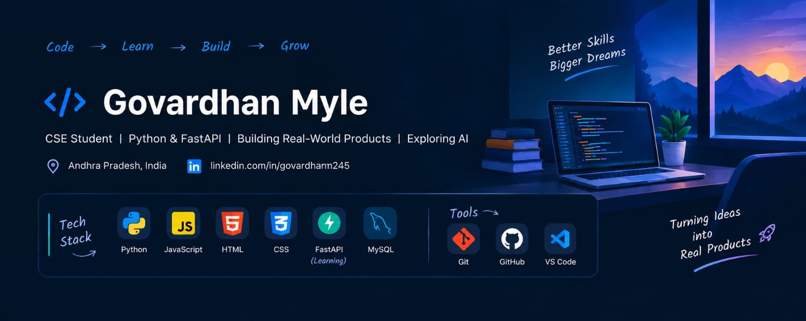

P

  

# 👋 Hey, I'm Govardhan Myle

### 🚀 B.Tech CSE Student | Building Projects | Exploring AI & Software Development

I’m a Computer Science student who enjoys turning ideas into working products.

Currently exploring **Python, FastAPI, JavaScript, React, MySQL, and AI-powered applications.**

---

## 🧑‍💻 About Me

- 🎓 Final-year B.Tech CSE student
- 🐍 Learning Python backend development
- ⚡ Exploring FastAPI & full-stack development
- 🤖 Interested in AI-powered products
- 🚀 Building and experimenting with startup ideas
- 📚 Always learning by building

---
## 🛠️ Tech Stack

### Languages

### Backend & Database

### Tools

## 🚀 Featured Projects

### 🔹 RoLens
A career readiness platform that analyzes resumes and job descriptions to identify skills, gaps, and learning recommendations.

### 🔹 Skin Discovery Platform
A product discovery platform focused on trustworthy skincare products, reviews, verified sellers, and purchase options.

### 🔹 Task Management Application
A task management project built to practice application development and CRUD functionality.

---

## 🌱 Currently Learning

Python
   ↓
FastAPI
   ↓
Databases
   ↓
Frontend
   ↓
AI Applications
   ↓
Building Real Products 🚀
